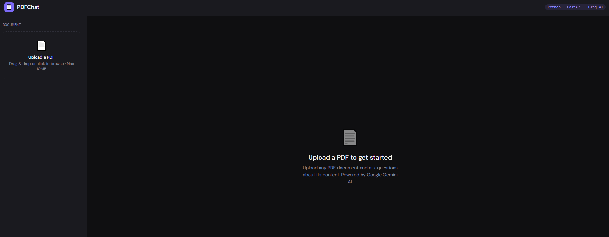
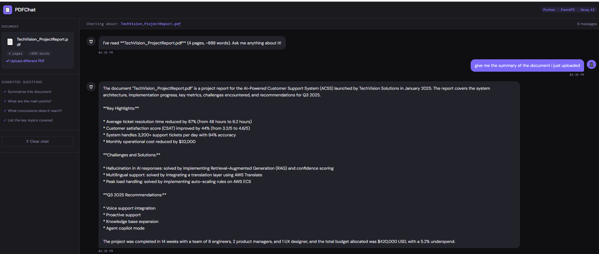
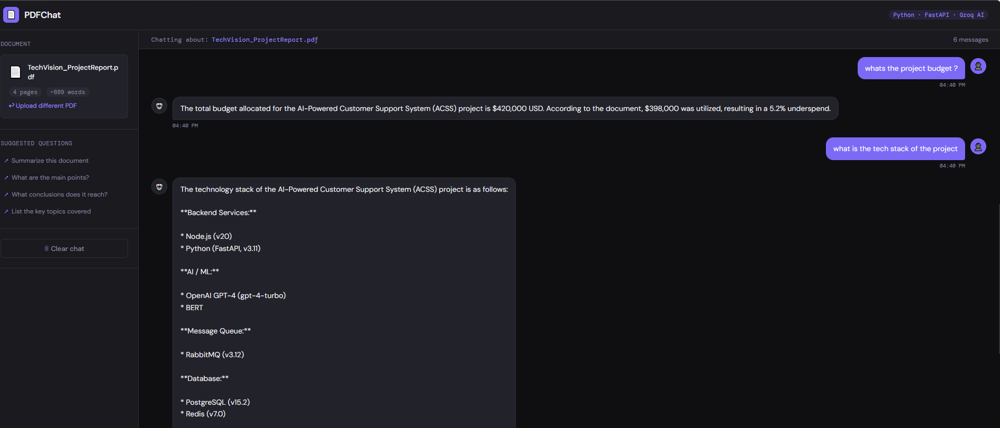
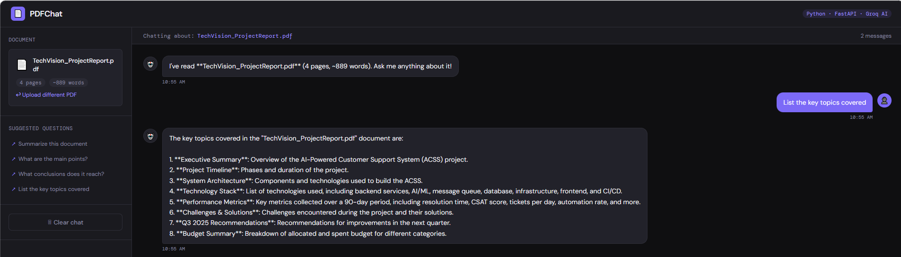

# PDFChat

An AI-powered PDF chatbot built with Python (FastAPI) and React. Upload any PDF document and have a natural language conversation with it using Groq AI.

## Features

- **PDF Upload** — drag & drop or click to upload any PDF (up to 10MB)
- **AI Chat** — ask questions in natural language, get grounded answers
- **Groq AI** — powered by LLaMA 3.3 70B via Groq (free tier)
- **Strict Grounding** — AI only answers from document content, no hallucination
- **Chat History** — full conversation context maintained per session
- **Suggested Questions** — quick prompts to get started instantly
- **Auto Docs** — FastAPI auto-generates interactive API docs at `/docs`
- **Responsive UI** — works on desktop and mobile

## Tech Stack

**Frontend:** React 18, Axios

**Backend:** Python 3.11, FastAPI, PyPDF2, httpx, Pydantic v2

**AI:** Groq API — LLaMA 3.3 70B (free tier)

## Project Structure

```
pdfchat/
├── backend/
│   ├── main.py                  # App entry point — middleware + routers only
│   ├── store.py                 # In-memory PDF session store
│   ├── models/
│   │   └── schemas.py           # Pydantic request/response models
│   ├── routes/
│   │   ├── upload.py            # POST /api/upload
│   │   └── chat.py              # POST /api/chat, GET /api/chat/session/:id
│   ├── services/
│   │   ├── pdf_service.py       # PDF validation + text extraction logic
│   │   └── groq_service.py      # Groq API integration + prompt building
│   ├── requirements.txt
│   └── .env
└── frontend/src/
    ├── components/
    │   ├── PDFUploader.js       # Drag & drop upload component
    │   └── ChatMessage.js       # Individual message bubble
    └── App.js                   # Main chat interface + state management
```

## Getting Started

### Prerequisites
- Python 3.9+
- Node.js v16+
- Free Groq API key from [console.groq.com](https://console.groq.com)

### 1. Clone the repo
```bash
git clone https://github.com/username/pdfchat.git
cd pdfchat
```

### 2. Backend setup
```bash
cd backend

# Create and activate virtual environment
python -m venv venv
venv\Scripts\activate      # Windows
source venv/bin/activate   # Mac/Linux

# Install dependencies
pip install -r requirements.txt

# Configure environment
cp .env .env

### 3. Run the backend
```bash
uvicorn main:app --reload --port 8000
```

API docs available at `http://localhost:8000/docs`

### 4. Frontend setup
```bash
cd ../frontend
npm install
npm start
```

App runs at `http://localhost:3000`

## API Endpoints

| Method | Endpoint | Description |
|--------|----------|-------------|
| GET | `/` | Health check |
| POST | `/api/upload` | Upload PDF and extract text |
| POST | `/api/chat` | Send message, get AI response |
| GET | `/api/chat/session/{fileId}` | Check if PDF session is active |

Full interactive docs at `http://localhost:8000/docs` (Swagger UI, auto-generated by FastAPI)

## Screenshots

### Upload a PDF


### Chat with document


### Chat with document


### Suggested Questions


## Architecture Decisions

**Separation of concerns** — Routes only handle HTTP. Business logic lives in services. Data contracts defined in models/schemas.py using Pydantic v2.

**In-memory storage** — PDF text is stored in memory per session. In a production environment this would be replaced with Redis for persistence and scalability.

**Provider-agnostic AI layer** — The Groq integration is isolated in `groq_service.py`. Switching to a different AI provider (OpenAI, Anthropic) only requires changes to that single file.

## Note
Works best with text-based PDFs under 8 pages on the free Groq tier. Scanned or image-based PDFs are not supported as they contain no extractable text.

## License
MIT
